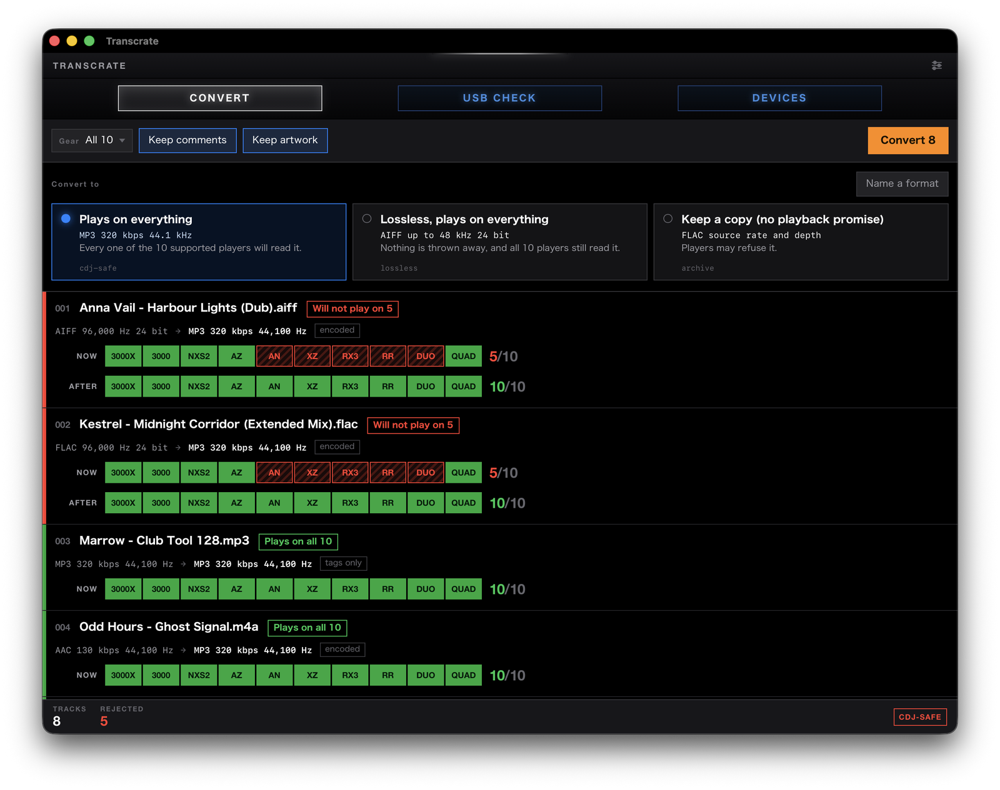

# Transcrate

[English](README.md)

USB に入れる曲を変換して, 現場で鳴るかどうかを出発前に確認する.

Transcrate は ffmpeg で音声を変換し, その結果を CDJ / XDJ が実際に受け付ける
範囲と照合する. コーデック, サンプリングレート, ビット深度, ファイルシステム —
すべてメーカーの説明書に基づく.

[**最新版をダウンロード**](https://github.com/hiroaki222/transcrate/releases/latest)
— Apple Silicon 向けの `.dmg` と Windows 向けの `.exe`. どちらも ffmpeg を同梱.



各曲に機材 10 台分のランプが並ぶ. 順序は常に同じ. 下の段は変換後の判定なので,
赤い行が緑に変わることを実行前に確認できる. 再生できないランプには斜線が入って
いて, 色を見分けられなくても読める.

## 画面から使う

ターミナルを開きたくない人向け. 中身は同じで, 同じ表を見て同じ答えを返す.

```sh
cd gui
bun install
bun run tauri dev
```

[Bun](https://bun.sh) と, PATH の通った ffmpeg が要る. `bun run tauri build` で
macOS なら `.app`, Windows なら `.msi` ができる.

画面は 3 枚.

- **CONVERT** — 曲かフォルダを窓に落とす. 各行に, 今の形式, 変換後の形式, そして
  機材 10 台分のランプが並ぶ. 緑が再生できる機材, 赤い斜線が再生できない機材.
  下の段には変換後の判定が出るので, 赤い行が緑に変わることを実行前に確認できる.
- **USB CHECK** — 挿したメディアを指定すると, どの機材が読めるかを判定する.
  読み取り専用で, 初期化のボタンは置いていない.

  

- **DEVICES** — 対応表そのもの. 各機材の発売年を併記してある.

表示言語は OS の設定に従う. 日本語と英語があり, 設定画面で固定もできる.

公式資料の記述が一致しない場合は, 再生できない側で判定する. XDJ-XZ の exFAT が
これに当たり, 画面には「不可」とだけ出る. 資料の矛盾は現場で解決できない.

## コマンドラインから使う

Rust 1.88 以降が必要.

```sh
git clone https://github.com/hiroaki222/transcrate
cd transcrate
cargo run -p transcrate-cli -- devices
```

```
DEVICE         YEAR     MP3   AAC    WAV   AIFF   FLAC   ALAC  EXFAT
XDJ-AN         2026     48k   48k    48k    48k    48k    48k  yes
CDJ-3000X      2025     48k   48k    96k    96k    96k    96k  yes
XDJ-AZ         2025     48k   48k    96k    96k    96k    96k  yes
OMNIS-DUO      2024     48k   48k    48k    48k    48k    48k  yes
OPUS-QUAD      2023     48k   48k    96k    96k    96k    96k  yes
XDJ-RX3        2021     48k   48k    48k    48k    48k      -  yes
CDJ-3000       2020     48k   48k    96k    96k    96k    96k  yes
XDJ-XZ         2019     48k   48k    48k    48k    48k      -  sources disagree
XDJ-RR         2018     48k   48k    48k    48k      -      -  no
CDJ-2000NXS2   2016     48k   48k    96k    96k    96k    96k  no
```

フォルダごと変換する. ffmpeg が PATH に必要:

```sh
cargo run -p transcrate-cli -- convert ~/Music
```

「全部」を指定する方法は 3 つある:

```sh
transcrate convert ~/Music              # フォルダごと (サブフォルダも含む)
transcrate convert *                    # シェルが展開したもののうち音声だけ
transcrate convert a.wav b.flac         # 個別に指定
```

フォルダ指定でもグロブでも音声ファイルだけを拾うため, ジャケット画像や
プレイリストはエラーにならず単に無視される. 前回の実行で作られた `_transcrate`
フォルダも除外されるので, 二度実行しても出力を再変換することはない.

ただしパスを 1 つだけ指定した場合は, 拡張子に関係なく必ず処理を試みる. 単一の
ファイル名を打った人はそのファイルを指定したのであって, 拡張子より ffprobe の
判定の方が正確だからである.

オプションはファイル名の前後どちらに置いてもよい. `convert -p lossless
track.wav` と `convert track.wav -p lossless` は同じ意味になる. 曲名に `&` や
括弧が多く含まれる場合は, フォルダ指定を使うか, tab 補完にエスケープさせると
楽になる.

```
~/Music/track.flac
  FLAC 96 kHz 24-bit -> MP3 44.1 kHz 320 kbps  (encoded)
  ~/Music/_transcrate/track.mp3
~/Music/already-fine.mp3
  MP3 44.1 kHz 320 kbps -> MP3 44.1 kHz 320 kbps  (copied unchanged)
  ~/Music/_transcrate/already-fine.mp3
```

出力は入力と同じ階層の `_transcrate` フォルダに置かれる. 元ファイルには一切
書き込まない. 既に目的の形式になっているファイルは再エンコードせずコピーする.
速いうえに, ロッシー音源を二度潰さずに済む.

変換はコア数ぶん並列で走り, 各行は変換が終わったものから順に出る. 60 秒の
96 kHz FLAC 14 本を MP3 に変換した場合, 逐次で 2.96 秒, 14 コア並列で 0.56 秒
だった (この環境での実測). CPU 時間は同じで, 待ち時間だけが 5 分の 1 になる.
`-j N` で並列数を制限できる.

プロファイルは 3 つ. `-p` で選ぶ:

| プロファイル | 出力 | 用途 |
|---|---|---|
| `cdj-safe` (既定) | MP3 320 kbps, 44.1 kHz | 対応表の全機種で再生できる |
| `lossless` | AIFF, 最大 48 kHz / 24 bit | ロスレスかつ全機種で再生できる |
| `archive` | FLAC, 元のレートと深度のまま | 再生用ではなく保管用 |

形式だけを直接指定することもできる. この場合はコンテナだけが変わり, 元の
サンプリングレートとビット深度はそのまま残る:

```sh
cargo run -p transcrate-cli -- convert ~/Music/track.flac --to aiff
```

指定できるのは `mp3`, `aac`, `alac`, `flac`, `wav`, `aiff`. プロファイルと
違って上限を持たないため, 96 kHz の音源は 96 kHz のまま出力される. 現場に
持っていくなら, 出力を `check` にかけて確認すること.

ビット深度を下げるときは dither を自動で入れる. サンプリングレートの変更では
入れない. dither はそのための処理ではないため.

### タグとアートワーク

元ファイルが持っていたタグはそのまま引き継ぐ. ただし `lyrics-eng` は空にする.
歌詞を CDJ で読む人はおらず, リッピングツールが宣伝文句を書き込む場所でもある.
タイトル・アーティスト・アルバム・ジャンル・キー・BPM は残す. ブラウザで探す
ために必要な情報だからである.

コメントも残す. 配信サイトが宣伝文句を書き込む場所であり, CDJ はそれをブラウザ
上でタイトルの隣に表示するため消したくもなるが, 自分でキューのメモや Camelot
キーを書き込んでいる場合, 消すと取り戻せない. 消したいときは `--clear-comment`
を付ける.

### 変換せずにタグだけ整える

```sh
transcrate retag ~/Music
```

```
[1/3] track.aiff -> _transcrate/track.aiff  (tags rewritten, audio untouched)
[2/3] already.mp3 -> _transcrate/already.mp3  (tags rewritten, audio untouched)
[3/3] track.flac -> _transcrate/track.flac  (tags rewritten, audio untouched)
```

各ファイルは元の形式のまま出力される. MP3 と AIFF が混在したフォルダでも,
拡張子ごとにコマンドを分ける必要はない. 音声ストリームはそのままコピーされる
ため, ロッシー音源が文字列の書き換えで劣化することはなく, 既に正しい音声を
再エンコードする時間もかからない.

`--no-artwork` と `--clear-comment` は `convert` と同じ意味で使える:

```sh
transcrate retag ~/Music --no-artwork                 # ジャケットを全部消す
transcrate retag ~/Music --no-artwork --clear-comment  # ジャケットもコメントも消す
```

埋め込みアートワークも引き継ぐ. rekordbox と CDJ のブラウザが認識できる形で
ストリームにラベルを付ける. `--no-artwork` を付けると削除する.

見落としやすい点が 2 つある:

- **MP3 と AIFF は ID3v2.3 で書く.** ffmpeg の既定は 2.4 だが, 機材側の挙動は
  2.3 の方が安定している.
- **AIFF の muxer は指定しない限り ID3 チャンクを書かない.** アートワークも
  一緒に失われる. タイトルとアーティストは AIFF 独自のチャンクに残るため,
  「タグが消えた」ではなく「ジャケットだけ出ない」という形で現れて気づき
  にくい. このフラグは有効にしてある.

手持ちのファイルがどの機種で鳴るかを調べる. こちらは `ffprobe` が PATH に必要
(ffmpeg に同梱されている):

```sh
cargo run -p transcrate-cli -- check ~/Music/track.flac
```

```
~/Music/track.flac
  FLAC 96 kHz 24-bit
  plays on       CDJ-3000X, XDJ-AZ, OPUS-QUAD, CDJ-3000, CDJ-2000NXS2
  XDJ-AN         96 kHz is not supported for FLAC
  OMNIS-DUO      96 kHz is not supported for FLAC
  XDJ-RX3        96 kHz is not supported for FLAC
  XDJ-XZ         96 kHz is not supported for FLAC
  XDJ-RR         FLAC is not supported
```

実際に持っていく機材だけに絞ることもできる:

```sh
cargo run -p transcrate-cli -- check ~/Music/*.flac --device cdj-3000,xdj-rr
```

`--failing` を付けると, 既に再生できるファイルは表示されず, 対処が必要な
ものだけが残る:

```sh
transcrate check ~/Music --failing -d xdj-rr
```

```
./float32.wav
  WAV 48 kHz 32-bit
  XDJ-RR         32-bit is not supported for WAV

./hires.flac
  FLAC 96 kHz 24-bit
  XDJ-RR         FLAC is not supported

2 of 6 rejected
```

ここでの「失敗」は, 指定した機種の**いずれか 1 つでも**再生できないことを指す.
10 機種のうち 9 機種で鳴っても, 残り 1 機種が現場にあればセットは止まる.

処理中は進捗が stderr に表示される. ただし stderr が端末のときだけなので,
結果をファイルや他のコマンドにパイプしても出力は汚れない.

1 つでも弾かれた場合は非ゼロで終了するので, スクリプトの判定に使える.

### PATH に入れる

```sh
cargo install --path crates/transcrate-cli --locked
transcrate completions zsh > ~/.zfunc/_transcrate
```

pull したあとは両方とも実行し直すこと. バイナリと補完スクリプトは別々に生成
されるため, 古いバイナリのままだとソースにあるはずのコマンドが
`unrecognized subcommand` になり, 古い補完スクリプトは存在しないフラグを
候補に出す.

### シェル補完

```sh
mkdir -p ~/.zfunc
transcrate completions zsh > ~/.zfunc/_transcrate
```

`~/.zshrc` に以下を追加する:

```sh
fpath=("$HOME/.zfunc" $fpath)
autoload -Uz compinit && compinit
```

`bash`, `fish`, `powershell`, `elvish` にも対応. 機種 ID も補完されるので,
`--device <TAB>` で 10 機種が一覧される.

zsh ではファイル引数の補完が音声ファイルとディレクトリだけになる. 曲と同じ
フォルダに置いてあるジャケット画像や PDF は候補に出ない.

テストと lint. CI で走るものと同じ:

```sh
cargo fmt --all --check
cargo clippy --all-targets --all-features -- -D warnings
cargo test --all-features
```

## なぜ作るのか

DJ 機材は互いに仕様が食い違っていて, しかもその食い違い方が直感に反する.

- **2016 年の CDJ-2000NXS2 は 96 kHz の FLAC を再生する. 2026 年の XDJ-AN は
  48 kHz で止まる.** 新しい方が高性能とは限らない.
- **その CDJ-2000NXS2 は exFAT の USB を読めない.** 2020 年以降の機種はすべて
  読めるが, XDJ-RX3 は exFAT を読める代わりに 96 kHz を拒否する. 制約が交差
  するので, 機種を性能順に並べることができない.
- **`.m4a` の中身は AAC と ALAC のどちらでもありうる.** AAC しか受け付けない
  機種は ALAC に対して `E-8305` を返すが, 拡張子からは何も分からない.

どれか 1 つ外すと, ブースに立ってから気づくことになる.

## USB のチェック

```sh
transcrate usb /Volumes/DJ
```

```
/Volumes/DJ
  exFAT

  reads it       CDJ-3000X, CDJ-3000, XDJ-AZ, XDJ-AN, XDJ-RX3, OMNIS-DUO, OPUS-QUAD
  CDJ-2000NXS2   does not read exFAT
  XDJ-XZ         sources disagree about exFAT
  XDJ-RR         does not read exFAT
```

exFAT は何も考えずに選びがちだが, まだ現場に残っている 2 機種が読めなくなる.
`-d` で実際に挿す機材だけに絞れる. その機材のどれかが読めない場合は非ゼロで
終了する.

**読み取り専用.** ドライブへの書き込み, フォーマット, ファイルの移動は一切
行わない. 金曜の夜に自分のセットへ向けるツールが, それを壊せる必要はない.

## データの出どころ

表の数値はすべてメーカーの説明書から取っている. 根拠とした文書の型番は
[docs/device-compatibility.ja.md](docs/device-compatibility.ja.md) に記録して
ある.

公式の情報同士が食い違う箇所 (XDJ-XZ の exFAT) は, どちらかを選ばずに
「食い違っている」と表示する.

## できていること / これから

できていること:

- WAV / FLAC / AIFF / M4A / MP3 の相互変換. 複数ファイルは並列で処理する
- 上の表に基づく, 機種ごとの判定
- USB の診断. 読み取り専用で, ドライブには一切書き込まない
- タグとジャケット画像の引き継ぎ, および削除
- CLI と同じコアの上に載る macOS / Windows 向けの画面

これから:

- ffmpeg の同梱. 何も入れなくても起動できるようにする
- USB のファイルシステムだけでなく, 中身も走査する
- `--json` 出力. 他のプログラムから判定を扱えるようにする

## 配布について

まだリリースは切っていないが, タグを打つと以下がビルドされて添付される.

- **画面版** — Apple Silicon 向けの `.dmg` と Windows 向けの `.exe` インストーラ.
  どちらも ffmpeg を同梱しているので, 事前に何かを入れる必要はない.
- **コマンドライン版** — プラットフォームごとの書庫. 中身はバイナリ 1 つ.
  こちらは PATH の通った ffmpeg が必要.

macOS は Apple Silicon のみ. Intel Mac は 2020 年を最後に出ておらず, 対応する
には ffmpeg をもう一つビルドして universal バンドルを組む必要がある.

いずれも署名はしていない. Apple の開発者証明書は年 99 ドルで, 誰も使っていない
段階で払う理由が薄い. 署名のないアプリは macOS が初回の起動を止めるが, 開き方は
Apple が案内している: [身元不明の開発者による Mac App を開く][unsigned-mac].
一度やれば次からは普通に開く. Windows では SmartScreen が
**詳細情報 → 実行** を求めてくる.

[unsigned-mac]: https://support.apple.com/ja-jp/guide/mac-help/mh40616/mac

## ライセンス

[MIT](LICENSE-MIT) または [Apache-2.0](LICENSE-APACHE) のどちらでも.

ffmpeg は別プロセスとして起動しており, このプログラムにリンクしてはいない.

画面版のリリースには **LGPL** ビルドの ffmpeg を実行ファイルの隣に同梱する.
GPL ビルドは使わない. このプログラムは MIT / Apache-2.0 であり, 同じバンドルに
GPL のバイナリを入れると, 配布物側に GPL の義務が及んでしまうためである. LGPL
ビルドでも書き出しに使う形式はすべて賄える — MP3 は libmp3lame, AAC は ffmpeg
自身のエンコーダ, FLAC / ALAC / PCM は本体機能である. Windows は BtbN が公開して
いる LGPL ビルドを使う. macOS 向けの LGPL ビルドは公開されていないため,
[リリース時にソースからビルドしている](.github/scripts/build-ffmpeg-macos.sh).
GPL 専用の部品は外してある.

チェックアウトした状態には同梱物がないので, PATH の ffmpeg にフォールバックする.
自前のビルドを使いたい場合もこの挙動が都合がよい.
