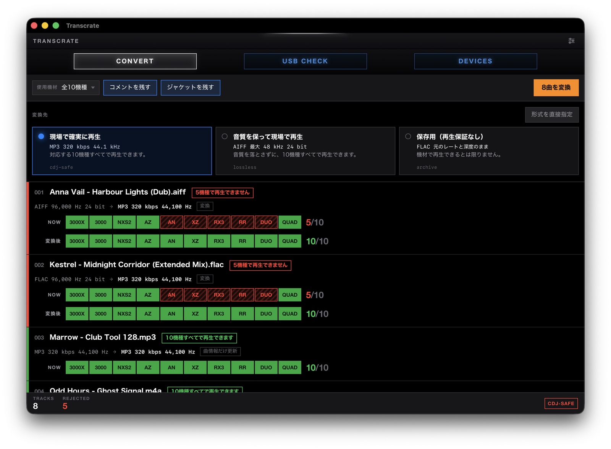
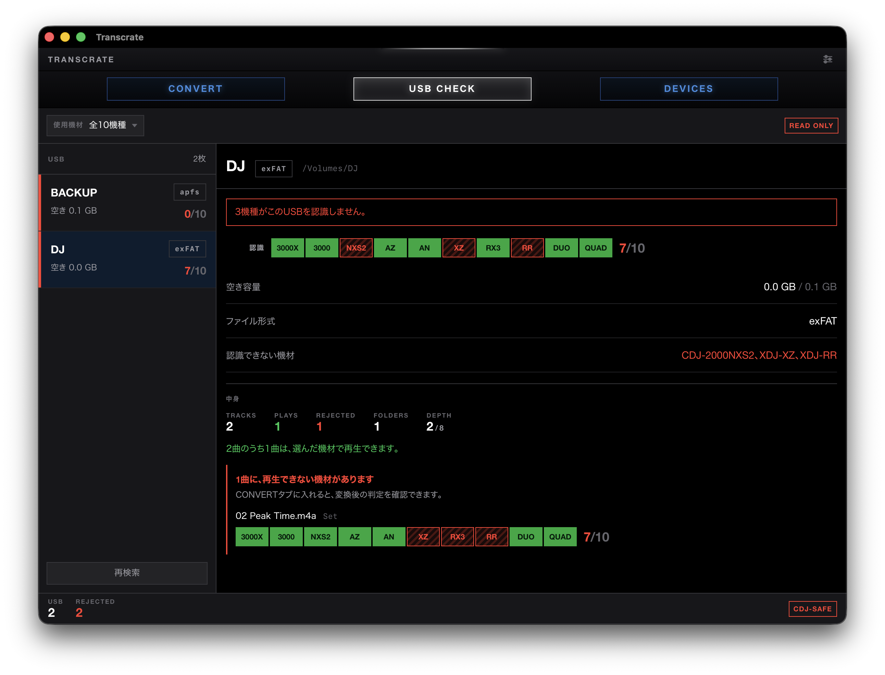

# Transcrate

[English](README.md)

USB に入れる曲を変換して、現場で鳴るかどうかを出発前に確かめるツールです。

[**ダウンロード**](https://github.com/hiroaki222/transcrate/releases/latest) — Apple Silicon 向けの `.dmg` と Windows 向けの `.exe`。どちらも ffmpeg を同梱しているので、ほかに用意するものはありません。



曲ごとに機材 10 台分のランプが、いつも同じ順番で並びます。下の段は変換後の判定なので、赤かった行が緑に変わることを実行前に確認できます。再生できないランプには斜線が入るため、色を見分けられなくても読めます。

コマンドライン版もあります。判定に使う対応表は、メーカーの説明書から取ったものです。以下はこの 3 つの話です。

## なぜ作ったか

DJ 機材は互いに仕様が食い違っていて、しかもその食い違い方が直感に反します。

- **2016 年の CDJ-2000NXS2 は 96 kHz の FLAC を再生しますが、2026 年の XDJ-AN は 48 kHz で止まります。** 新しい方が高性能とは限りません。
- **その CDJ-2000NXS2 は exFAT の USB を読めません。** 2020 年以降の機種はすべて読めますが、XDJ-RX3 は exFAT を読める代わりに 96 kHz を拒否します。制約が交差するので、機種を性能順に並べることができません。
- **`.m4a` の中身は AAC と ALAC のどちらでもありえます。** AAC しか受け付けない機種は ALAC に対して `E-8305` を返しますが、拡張子からは何も分かりません。

どれか 1 つ外すと、ブースに立ってから気づくことになります。

## どの機材で何が鳴るか

```
DEVICE         YEAR     MP3   AAC    WAV   AIFF   FLAC   ALAC  EXFAT
XDJ-AN         2026     48k   48k    48k    48k    48k    48k  yes
CDJ-3000X      2025     48k   48k    96k    96k    96k    96k  yes
XDJ-AZ         2025     48k   48k    96k    96k    96k    96k  yes
OMNIS-DUO      2024     48k   48k    48k    48k    48k    48k  yes
OPUS-QUAD      2023     48k   48k    96k    96k    96k    96k  yes
XDJ-RX3        2021     48k   48k    48k    48k    48k      -  yes
CDJ-3000       2020     48k   48k    96k    96k    96k    96k  yes
XDJ-XZ         2019     48k   48k    48k    48k    48k      -  sources disagree
XDJ-RR         2018     48k   48k    48k    48k      -      -  no
CDJ-2000NXS2   2016     48k   48k    96k    96k    96k    96k  no
```

数値はすべてメーカーの説明書から取っています。根拠とした文書の型番は [docs/device-compatibility.ja.md](docs/device-compatibility.ja.md) に記録してあります。

公式の情報同士が食い違う箇所 (XDJ-XZ の exFAT) は、どちらかを選ばずに「食い違っている」と表示します。アプリ側は再生できない側に倒して「不可」とだけ出します。資料の矛盾は、現場では確かめようがないためです。

## アプリ

[ダウンロード](https://github.com/hiroaki222/transcrate/releases/latest)して開き、曲かフォルダをドラッグ&ドロップするだけです。

有料の開発者証明書は取得していません。年 99 ドルかかるうえ、まだ誰も使っていない段階で払う理由が薄いためです。そのため macOS も Windows も初回起動時に警告を出しますが、一度許可すれば次からは普通に開きます。macOS の手順は Apple が案内しています: [身元不明の開発者による Mac App を開く][unsigned-mac]。Windows では SmartScreen が **詳細情報 → 実行** を求めてきます。

画面は 3 つあります。

- **CONVERT** — 各行に、今の形式、変換後の形式、そして機材 10 台分のランプが並びます。緑が再生できる機材、赤い斜線が再生できない機材です。下の段には変換後の判定が出ます。

  

- **USB CHECK** — 挿したメディアを指定すると、まずどの機材が読めるかを判定します。続けて中の曲をすべて読み、機材が受け付けないものを名指しします。フォルダの構造も測ります。機材はフォルダ 8 階層までしか降りず、1 フォルダに 10,000 件までしか並べないため、どちらかを超えると、メディアは認識され、曲もそこにあるのに、機材の画面には何も出てきません。読み取り専用で、初期化のボタンは置いていません。

  

- **DEVICES** — 上の対応表そのものです。各機材の発売年も併記しています。

表示言語は OS の設定に従います。日本語と英語があり、設定画面で固定することもできます。

## コマンドライン

リリースにはプラットフォームごとの書庫が付いていて、中身はバイナリ 1 つです。こちらは PATH の通った ffmpeg が必要です。同梱しているのはアプリ版だけです。

```sh
transcrate convert ~/Music
```

「全部」を指定する方法は 3 つあります。

```sh
transcrate convert ~/Music              # フォルダごと (サブフォルダも含む)
transcrate convert *                    # シェルが展開したもののうち音声だけ
transcrate convert a.wav b.flac         # 個別に指定
```

フォルダ指定でもグロブでも音声ファイルだけを拾うので、ジャケット画像やプレイリストはエラーにならず、そのまま無視されます。前回の実行で作られた `_transcrate` フォルダも除外するため、二度実行しても出力を再変換することはありません。

ただしパスを 1 つだけ指定した場合は、拡張子に関係なく必ず処理を試みます。ファイルを 1 つだけ指定したなら、そのファイルを処理したい意図がはっきりしているためです。判定も、拡張子より ffprobe の方が正確です。

オプションはファイル名の前後どちらに置いても構いません。`convert -p lossless track.wav` と `convert track.wav -p lossless` は同じ意味になります。曲名に `&` や括弧が多く含まれる場合は、フォルダ指定を使うか、tab 補完にエスケープさせると楽です。

```
~/Music/track.flac
  FLAC 96 kHz 24-bit -> MP3 44.1 kHz 320 kbps  (encoded)
  ~/Music/_transcrate/track.mp3
~/Music/already-fine.mp3
  MP3 44.1 kHz 320 kbps -> MP3 44.1 kHz 320 kbps  (copied unchanged)
  ~/Music/_transcrate/already-fine.mp3
```

出力は入力と同じ階層の `_transcrate` フォルダに置かれ、元ファイルには一切書き込みません。すでに目的の形式になっているファイルは、再エンコードせずコピーします。速いうえに、ロッシー音源を二度潰さずに済みます。

変換はコア数ぶん並列で走り、各行は終わったものから順に出ます。60 秒の 96 kHz FLAC 14 本で、逐次 2.96 秒に対し 14 コア並列で 0.56 秒でした。`-j N` で並列数を制限できます。

プロファイルは 3 つあり、`-p` で選びます。

| プロファイル | 出力 | 用途 |
|---|---|---|
| `cdj-safe` (既定) | MP3 320 kbps, 44.1 kHz | 対応表の全機種で再生できる |
| `lossless` | AIFF, 最大 48 kHz / 24 bit | ロスレスかつ全機種で再生できる |
| `archive` | FLAC, 元のレートと深度のまま | 再生用ではなく保管用 |

形式だけを直接指定することもできます。この場合はコンテナだけが変わり、元のサンプリングレートとビット深度はそのまま残ります。

```sh
transcrate convert ~/Music/track.flac --to aiff
```

指定できるのは `mp3`, `aac`, `alac`, `flac`, `wav`, `aiff` です。プロファイルと違って上限を持たないので、96 kHz の音源は 96 kHz のまま出力されます。現場に持っていくなら、出力を `check` にかけて確かめてください。

ビット深度を下げるときは dither を自動で入れます。サンプリングレートを変えるときは入れません。dither はサンプリングレート変換に使う処理ではないためです。

### 曲を調べる

```sh
transcrate check ~/Music/track.flac
```

```
~/Music/track.flac
  FLAC 96 kHz 24-bit
  plays on       CDJ-3000X, XDJ-AZ, OPUS-QUAD, CDJ-3000, CDJ-2000NXS2
  XDJ-AN         96 kHz is not supported for FLAC
  OMNIS-DUO      96 kHz is not supported for FLAC
  XDJ-RX3        96 kHz is not supported for FLAC
  XDJ-XZ         96 kHz is not supported for FLAC
  XDJ-RR         FLAC is not supported
```

実際に持っていく機材だけに絞り、すでに再生できるものを除くこともできます。

```sh
transcrate check ~/Music --failing -d cdj-3000,xdj-rr
```

```
./float32.wav
  WAV 48 kHz 32-bit
  XDJ-RR         32-bit is not supported for WAV

./hires.flac
  FLAC 96 kHz 24-bit
  XDJ-RR         FLAC is not supported

2 of 6 rejected
```

ここでの「失敗」は、指定した機種の**いずれか 1 つでも**再生できないことを指します。10 機種のうち 9 機種で鳴っても、残り 1 機種が現場にあればセットは止まります。

処理中は進捗が stderr に出ます。ただし stderr が端末のときだけなので、結果をファイルや他のコマンドにパイプしても出力は汚れません。1 つでも弾かれた場合は非ゼロで終了するので、スクリプトの判定に使えます。

### USB を調べる

```sh
transcrate usb /Volumes/DJ
```

```
/Volumes/DJ
  exFAT

  reads it       CDJ-3000X, CDJ-3000, XDJ-AZ, XDJ-AN, XDJ-RX3, OMNIS-DUO, OPUS-QUAD
  CDJ-2000NXS2   does not read exFAT
  XDJ-XZ         sources disagree about exFAT
  XDJ-RR         does not read exFAT

  2 tracks, 1 folder, 2 deep

  1 of 2 tracks will play on every player named

  1 track at least one player will not take
    Set/02 Peak Time.m4a    XDJ-XZ: ALAC is not supported, XDJ-RX3: ALAC is …
```

exFAT は何も考えずに選びがちですが、まだ現場に残っている 2 機種が読めなくなります。`-d` で実際に挿す機材だけに絞れます。その機材のどれかが読めない場合は非ゼロで終了します。

ファイルシステムの判定に続けて、中の曲を 1 曲ずつ ffprobe で読みます。ここが時間のかかる側なので、`--no-tracks` を付けるとファイルシステムの判定だけで止まります。フォルダの構造も測ります。機材はフォルダ 8 階層までしか降りず、1 フォルダに 10,000 件までしか並べません。どちらかを超えると、メディアは認識され、曲もそこにあるのに、機材の画面には何も出てきません。

**読み取り専用です。** ドライブへの書き込み、フォーマット、ファイルの移動は一切行いません。自分のセットに向けて使うツールが、それを壊せる必要はありません。

### タグとアートワーク

元ファイルが持っていたタグはそのまま引き継ぎます。ただし `lyrics-eng` は空にします。歌詞を CDJ で読む人はおらず、リッピングツールが宣伝文句を書き込む場所でもあるためです。タイトル・アーティスト・アルバム・ジャンル・キー・BPM は残します。ブラウザで曲を探すのに必要な情報だからです。

コメントも残します。配信サイトが宣伝文句を書き込む場所で、CDJ はそれをブラウザ上でタイトルの隣に表示するため消したくもなりますが、自分でキューのメモや Camelot キーを書き込んでいる場合、消すと取り戻せません。消したいときは `--clear-comment` を付けてください。

埋め込みアートワークも引き継ぎ、rekordbox と CDJ のブラウザが認識できる形でストリームにラベルを付けます。`--no-artwork` を付けると削除します。

見落としやすい点が 2 つあります。

- **MP3 と AIFF は ID3v2.3 で書きます。** ffmpeg の既定は 2.4 ですが、機材側の挙動は 2.3 の方が安定しています。
- **AIFF の muxer は、指定しない限り ID3 チャンクを書きません。** アートワークも一緒に失われます。タイトルとアーティストは AIFF 独自のチャンクに残るので、「タグが消えた」ではなく「ジャケットだけ出ない」という形で現れて気づきにくくなります。このフラグは有効にしてあります。

音声に触らずタグだけ直すこともできます。

```sh
transcrate retag ~/Music
```

```
[1/3] track.aiff -> _transcrate/track.aiff  (tags rewritten, audio untouched)
[2/3] already.mp3 -> _transcrate/already.mp3  (tags rewritten, audio untouched)
[3/3] track.flac -> _transcrate/track.flac  (tags rewritten, audio untouched)
```

各ファイルは元の形式のまま出力されるので、MP3 と AIFF が混在したフォルダでも、拡張子ごとにコマンドを分ける必要はありません。音声ストリームはそのままコピーされるため、ロッシー音源が文字列の書き換えで劣化することはなく、すでに正しい音声を再エンコードする時間もかかりません。

### シェル補完

```sh
mkdir -p ~/.zfunc
transcrate completions zsh > ~/.zfunc/_transcrate
```

`~/.zshrc` に以下を追加します。

```sh
fpath=("$HOME/.zfunc" $fpath)
autoload -Uz compinit && compinit
```

`bash`, `fish`, `powershell`, `elvish` にも対応しています。機種 ID も補完されるので、`--device <TAB>` で 10 機種が一覧されます。

zsh ではファイル引数の補完が音声ファイルとディレクトリだけになります。曲と同じフォルダに置いてあるジャケット画像や PDF は候補に出ません。

## ソースからビルドする

Rust 1.88 以降と、PATH の通った ffmpeg が必要です。チェックアウトした状態には同梱物がないので、見つかった `ffmpeg` にフォールバックします。自前のビルドを使いたい場合も、この挙動が都合よく働きます。

```sh
git clone https://github.com/hiroaki222/transcrate
cd transcrate
cargo run -p transcrate-cli -- devices
```

コマンドラインを PATH に入れる場合は次のようにします。

```sh
cargo install --path crates/transcrate-cli --locked
transcrate completions zsh > ~/.zfunc/_transcrate
```

pull したあとは両方とも実行し直してください。バイナリと補完スクリプトは別々に生成されるため、古いバイナリのままだとソースにあるはずのコマンドが `unrecognized subcommand` になり、古い補完スクリプトは存在しないフラグを候補に出します。

アプリ版には [Bun](https://bun.sh) も必要です。

```sh
cd gui
bun install
bun run tauri dev
```

`bun run tauri build` を実行すると、macOS では `.dmg`、Windows では `.exe` インストーラができます。ただしリリース版と違って ffmpeg は同梱されません。

## 開発に参加する

CI で走るものと同じ 3 つです。

```sh
cargo fmt --all --check
cargo clippy --all-targets --all-features -- -D warnings
cargo test --all-features
```

統合テストは実際に変換を走らせます。CI で ffmpeg が見つからない場合はスキップせず失敗します。エンコーダに渡している引数が本当に通るかを確かめているのは、このテストだけだからです。

## これから

- USB のファイルシステムだけでなく、中身も走査する
- `--json` 出力。他のプログラムから判定を扱えるようにする

macOS は Apple Silicon のみに対応しています。Intel Mac は 2020 年を最後に出ておらず、対応するには ffmpeg をもう一つビルドして universal バンドルを組む必要があるためです。

[unsigned-mac]: https://support.apple.com/ja-jp/guide/mac-help/mh40616/mac

## ライセンス

[MIT](LICENSE-MIT) または [Apache-2.0](LICENSE-APACHE) のどちらでも構いません。

ffmpeg は別プロセスとして起動していて、このプログラムにリンクしてはいません。

アプリ版のリリースには **LGPL** ビルドの ffmpeg を実行ファイルの隣に同梱しています。GPL ビルドは使いません。このプログラムは MIT / Apache-2.0 なので、同じバンドルに GPL のバイナリを入れると、配布物側にも GPL の義務が及ぶためです。LGPL ビルドでも、書き出しに使う形式はすべて賄えます。MP3 は libmp3lame、AAC は ffmpeg 自身のエンコーダ、FLAC / ALAC / PCM は本体機能です。macOS 向けの LGPL ビルドは公開されておらず、Windows 向けに公開されているものはフルビルドで、切り詰めたものが 1 実行ファイルあたり 4 MB なのに対して 115 MB あり、それがダウンロードのたびに付いてきます。そのため [リリース時に両方をソースからビルドしています](.github/scripts/build-ffmpeg.sh)。対応形式の一覧は 1 か所に置いて共有し、GPL 専用の部品は外してあります。
